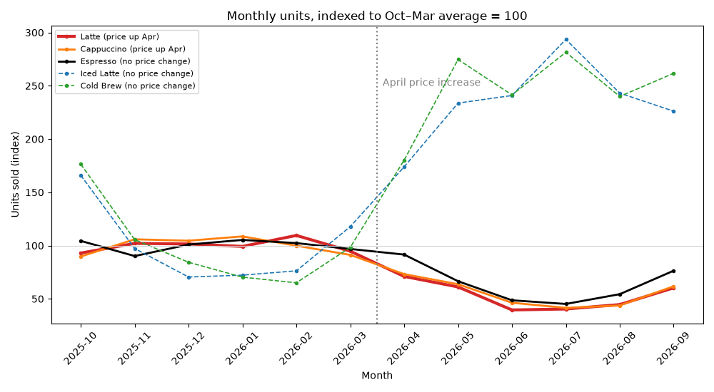

# Data Analyst Agent

Ask questions about any CSV file in plain English. The agent writes pandas code, runs it, reads the output, fixes its own errors, and draws charts. Every number in its answer comes from code it actually ran.

It's built directly on the Claude API. The agent loop is written by hand in about 70 lines (`Agent.ask` in [agent.py](agent.py)), with no agent framework.


This is a trick question. Latte sales fell 47% after the price rise, but espresso, whose price didn't change, fell 36% too, because customers switch to iced drinks in summer. The agent catches this and uses espresso as a baseline to estimate the price effect on its own: about 17%. The recording is real, with the model's thinking pauses shortened.

The chart it drew for that answer, with each drink's units set to 100 for the months before the increase:



## How it works

```
question ─▶ Claude ─▶ tool calls ─▶ run in sandbox ─▶ results ─▶ Claude ─▶ ... ─▶ answer
                         │                               │
                   run_python(code)              output or trimmed error
                   save_chart(code, name)        file path + the PNG itself
```

Each question runs this loop until Claude stops asking for tools. The full conversation is kept, so follow-ups like "now split that by store" build on earlier answers.

## Design decisions

- **A hand-written loop instead of a framework.** `Agent.ask` calls the model, runs every tool call in the response, and sends all results back in one message. It stops when the model answers without calling a tool. It also handles the edge cases a demo usually skips: refusals, tool input cut off at the output limit, malformed tool input, a cap on steps, and rolling back the conversation on Ctrl+C or an API error.
- **Code runs in a child process with persistent state.** Variables survive between calls, the way notebook cells do. If code hangs, the parent kills the child after 60 seconds and starts a fresh one. Errors are trimmed to the lines of the agent's own code (`line 2: df['price']` / `KeyError: 'price'`) instead of 40 frames of pandas internals, so the model can see what to fix.
- **The dataset profile is sent up front.** The system prompt lists each column's type, missing count, distinct count, and example values. That saves a tool call on every question. It also flags messy data early: 32 distinct spellings for 8 products is a hint that names need cleaning.
- **The model sees its own charts.** `save_chart` returns the PNG to the model as an image, so it can notice overlapping labels or a bad scale and redraw the chart.
- **Streaming output.** The answer prints as it's written, and each tool call shows a preview of the code it runs. The request also sets `thinking.display: "updates"`, so if the model writes a short progress note between tool calls, it prints dimmed. The model's full reasoning stays hidden.
- **Prompt caching.** The growing conversation is cached between turns. The usage line after each answer shows how many input tokens came from the cache.

## Sample data

[data/coffee_sales.csv](data/coffee_sales.csv) is a year of synthetic sales at a three-store coffee chain, generated by [make_sample_data.py](make_sample_data.py). Patterns and problems were planted on purpose, so you can check whether the agent's answers are right:

| Planted pattern | What a good answer notices |
|---|---|
| Downtown is busy on weekdays, Riverside on weekends | Weekend vs. weekday split differs by store |
| Campus sales collapse in summer and over winter break | Seasonal dips at Campus only |
| Iced drinks peak in summer, hot drinks in winter | Cold Brew and Iced Latte sell about 4x more in July than in January |
| Latte and Cappuccino rose $0.50 on 2026-04-01 | Latte units fell 35% (Feb-Mar vs. Apr-May), but Espresso, whose price didn't change, fell 21% too. Spring and the Matcha launch explain most of the drop, so blaming all 35% on the price is the trap |
| Matcha Latte launched 2026-03-01 | No sales before March, so whole-year averages understate it |

| Planted problem | Correct handling |
|---|---|
| `unit_price` stored as text like `"$4.75"` | Convert to numbers before doing math |
| Product names in mixed case with trailing spaces | Normalize before grouping (32 spellings become 8 products) |
| About 1.5% of rows missing `store` | Report them or set them aside; don't drop them silently |
| 165 duplicate rows | Remove them before totaling |
| Refunds recorded as negative quantities | Count them as negative revenue |

Questions to try:

- Which store makes the most revenue, and how does that change on weekends?
- How do iced drink sales change over the year? Show me a chart.
- Did the April price increase hurt latte sales?
- What are the busiest hours at each store?
- How is the Matcha Latte doing since it launched?

## Setup

You need [uv](https://docs.astral.sh/uv/) and an Anthropic API key.

```bash
uv sync
```

```bash
cp .env.example .env
```

Open `.env` and paste in your API key. Then start a chat:

```bash
uv run python agent.py data/coffee_sales.csv
```

Or ask one question and exit:

```bash
uv run python agent.py data/coffee_sales.csv -q "Which store makes the most revenue?"
```

Options:

- `--model`: defaults to `claude-opus-5-5`. `claude-sonnet-5-5` costs half as much.
- `--effort`: `low` to `max`, defaults to `high`. Lower is faster and cheaper; higher is more careful.
- `--out`: the folder for charts, `out/` by default.

## Tests

```bash
uv run pytest
```

No API key needed. The sandbox tests run real code. The agent-loop tests replace the API with a fake client that returns scripted model turns: tool calls, parallel calls, malformed input, cut-off input, charts, and refusals.

## Evaluation

The tests check the code; the eval checks the answers. [evals/cases.json](evals/cases.json) has 17 questions:

- 9 about the planted patterns, including the two traps
- 6 that only come out right if the data is cleaned first
- 2 the data can't answer (profit margin, customer age), where the agent should say so instead of guessing

Each question has checks with expected values that [evals/answer_key.py](evals/answer_key.py) computes from the data. Claude Sonnet 5.5 grades each answer against its checks, and a question passes only if every check does.

**Baseline: all 17 questions pass on both runs** with `claude-opus-5-5` at high effort (95% interval: 82% to 100%). An answer costs about $0.05 and takes about 16 seconds. Every answer and grade is in [results.jsonl](.claude/hillclimb/analyst-answers/baseline/results.jsonl). With a perfect baseline, the eval's main use is catching regressions, for example when trying a cheaper model or lower effort.

**Opus 5.5 vs. Sonnet 5.5**, with the same prompt, tools, effort and grader, 2 runs per question:

| | Opus 5.5 | Sonnet 5.5 |
|---|---|---|
| Questions passed on both runs | 17 of 17 | 16 of 17 |
| Cost per answer | $0.047 | $0.020 |
| Time per answer | 16 s | 11 s |

Sonnet costs 57% less and misses only the Matcha Latte average. In one run it averaged the Matcha over all 12 months without noting the March launch. In the other it noticed the launch but gave the wrong figure: $1,031 instead of $1,238. Opus got it right both times. Sonnet also graded its own answers here, so I re-graded them with Opus. The two graders agreed on 63 of 64 checks, and the one disagreement led to a stricter check. Sonnet's results are in [v1/results.jsonl](.claude/hillclimb/analyst-answers/v1/results.jsonl).

```bash
uv run python evals/run_eval.py
```

That runs every question twice, for about $1.75. Useful options:

- `--cases price-increase,refunds` runs only some questions.
- `--reps 1` runs each question once.
- `--variant v1 --model claude-sonnet-5-5` saves results for a different setup next to the baseline.
- `--regrade` re-grades saved answers after you change a check, without running the agent again.

The grader is tested too. `evals/check_judge.py` confirms that correct answers pass and bad ones fail: empty, "I don't know", an answer to a different question, and two subtle mistakes the agent really made. It costs about $0.09.

```bash
uv run python evals/check_judge.py
```

Building the eval caught problems on both sides:

- **A grader that was too lenient, twice.** It passed an answer that gave the right Matcha Latte figure and then ranked it wrongly. Later it passed one that gave the wrong figure, because the answer said the 12-month average understated the Matcha. Both are checked now, and both answers are kept in `check_judge.py` as tests.
- **A wrong answer key.** The first full run failed the agent for calling February the slowest month for iced drinks. January and February are tied (309 units each), so the key now accepts either. Reading failures before trusting them is what found it.

## Recording the demo

[docs/demo.gif](docs/demo.gif) is made by [scripts/make_demo_gif.py](scripts/make_demo_gif.py). The script runs the agent on a question, records everything it prints with timestamps, and draws each moment as a terminal frame with Pillow. Waits longer than 1.5 seconds are shortened, and the typing is animated.

```bash
uv run python scripts/make_demo_gif.py
```

That costs one agent run. To ask a different question, pass it as the first argument. The recording is saved to `out/demo_recording.json`, so you can adjust the look and re-render it without calling the API:

```bash
uv run python scripts/make_demo_gif.py --replay out/demo_recording.json
```

## Safety

The agent runs model-written Python on your machine with your user's permissions. The child process protects the agent from crashes and hangs. It does not stop malicious code. Two things to keep in mind:

- Only analyze files you trust. Cell values are shown to the model, so a CSV could contain text that tries to steer it.
- For untrusted data, run the agent in a container, or switch to Claude's server-side code execution tool, which runs code in Anthropic's sandbox.

## Ideas to extend it

- Close Sonnet's one gap, averaging a product that wasn't on sale all year, with a line in the system prompt, then re-run the eval on Sonnet.
- Try Opus at medium effort on the eval, to see whether it keeps 17 of 17 for less.
- Add a `--confirm` flag that shows each piece of code and waits for approval before running it.
- Support Excel, Parquet, or a SQL database as the data source.
- Put a Streamlit or Gradio front end on it, with charts shown inline.
